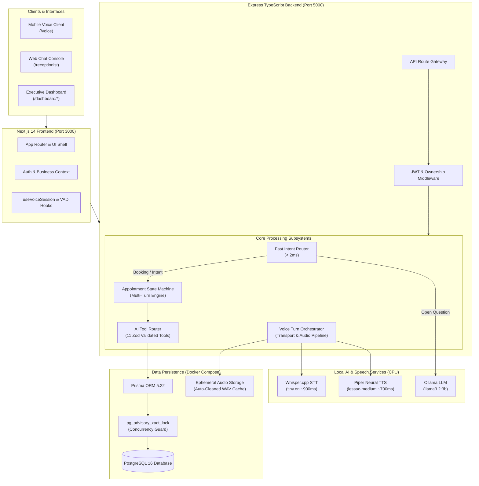
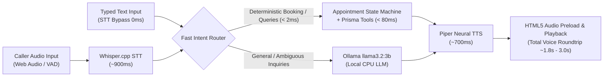

# 🤖 AI-Powered Smart Receptionist Platform

> **Intelligent conversations. Smarter appointments.**

[](https://www.typescriptlang.org/)
[](https://nextjs.org/)
[](https://reactjs.org/)
[](https://nodejs.org/)
[](https://expressjs.com/)
[](https://www.postgresql.org/)
[](https://www.prisma.io/)
[](https://tailwindcss.com/)
[](https://github.com/ggerganov/whisper.cpp)
[](https://github.com/rhasspy/piper)
[](https://ollama.com/)
[]()

An autonomous, full-stack, multi-tenant AI receptionist platform designed to streamline front-desk operations, automate appointment bookings, resolve caller inquiries, and manage customer records. Built using 100% local, open-source AI and speech runtimes, ensuring complete privacy, zero per-minute API costs, and sub-second operational responses.

---

## 📌 Current Development Status

```text
Current Status: Capstone Demo Ready
Verified: End-to-End Voice Booking, Database Persistence, Multi-Tenant Isolation, 32/32 Test Suites Passing
```

The platform has completed full development, integration testing, and rigorous live verification. All critical subsystems—including local speech-to-text, deterministic dialogue state management, transactional database persistence, concurrency locking, and executive business dashboards—are fully functional, tested, and ready for demonstration.

---

## 🌟 Project Overview

### The Problem
Traditional small-to-medium businesses (dental clinics, dermatology practices, salons, advisory firms) struggle with front-desk overload:
- **Missed Calls & Lost Revenue:** Inquiries occurring after hours or during peak rushes often go unanswered.
- **Double-Bookings & Scheduling Errors:** Manual calendar management frequently causes overlapping appointments and specialist mismatches.
- **Costly Cloud Subscriptions:** Existing SaaS solutions rely on expensive third-party speech and AI APIs (e.g., Twilio + OpenAI + ElevenLabs), incurring prohibitive per-minute and per-token fees while exposing sensitive patient/client data to external clouds.

### The Solution
The **AI-Powered Smart Receptionist Platform** delivers an autonomous, on-premise receptionist experience:
1. **Autonomous Voice & Text Reception:** Answers caller questions, explains services, checks specialist availability, and books appointments naturally through speech or text.
2. **Deterministic Booking State Machine:** Eliminates LLM hallucinations during scheduling by using a fast, rule-guided conversational engine paired with real-time database queries.
3. **100% Local & Free AI Architecture:** Runs on commodity hardware using Whisper.cpp for speech-to-text, Piper for neural text-to-speech, and Ollama (`llama3.2:3b`) for general inquiries—requiring zero paid cloud API subscriptions.
4. **Enterprise Multi-Tenancy:** Provides business owners with an executive dashboard to manage staff, catalog services, track customer relationships, inspect conversation logs, and monitor voice conversion analytics.

---

## ✨ Key Features

### 🤖 AI Voice Receptionist
- **Local Speech-to-Text (STT):** Powered by `whisper.cpp` (`tiny.en`), transcribing caller speech locally in ~900ms with a lightweight ~77 MB RAM footprint.
- **Neural Text-to-Speech (TTS):** Powered by `Piper TTS` (`en_US-lessac-medium`), producing clear, natural spoken responses in ~600–850ms without robotic SAPI artifacts.
- **Sub-Second Fast Intent Router:** Classifies standard intents (greetings, service inquiries, booking requests, cancellations) deterministically in $< 2$ms, completely bypassing LLM latency.
- **Local LLM Fallback:** Gracefully routes open-ended business inquiries to local Ollama (`llama3.2:3b`), ensuring natural dialogue while maintaining zero cloud dependence.

### 📅 Intelligent Appointment Booking
- **Catalog Service Matching:** Intelligently matches caller requests (e.g., *"I need a dental cleaning"*) to catalog services, durations, and pricing.
- **Specialist Auto-Assignment:** Resolves specific staff requests (*"Book with Dr. Sarah"*) or automatically selects an eligible specialist matching the requested service.
- **Real-Time Slot Discovery:** Queries PostgreSQL directly to discover open intervals matching business hours and specialist schedules, preventing calendar conflicts.
- **Exact Slot Retention:** Locks the agreed-upon date and time slot throughout the dialogue, preventing drift during subsequent conversational turns.
- **Mandatory Customer Identification:** Explicitly requests and validates customer full name and phone number before proceeding to confirmation.
- **Atomic Database Persistence:** Creates real records in PostgreSQL across `customers` and `appointments` tables with an assigned database UUID.

### 🗣️ Conversational Correction Handling
- **Mid-Conversation Revisions:** Handles spontaneous updates naturally (*"Actually, make it 3 PM instead"*, *"No, my name is spelt Alan"*, *"Can I change to a Consultation?"*) without resetting the conversation state.
- **Confirmation Rejection Recovery:** If a customer says *"No"* or *"Wait, that's wrong"* when presented with the booking summary, the system acknowledges the cancellation gracefully, preserves captured parameters, and asks which detail to correct.
- **Context Preservation:** Keeps track of previously provided parameters so callers only need to correct what changed.

### ⌨️ Hybrid Voice + Typed Input (Mobile Voice Client)
- **"Type Instead" Mode:** Mobile `/voice` interface features an inline text-input toggle, allowing users to type sensitive details (such as names or phone numbers) in noisy environments.
- **Zero-Latency STT Bypass:** Typed turns bypass audio processing and speech-to-text entirely (0ms STT latency), feeding directly into the deterministic state machine.
- **Unified Spoken Feedback:** The system continues responding with synthesized neural audio and real-time text responses, maintaining conversation continuity.

### 🔒 Booking Accuracy & Concurrency Safety
- **Zero False Confirmation Guarantee:** The AI is strictly barred from announcing an appointment as confirmed until an actual appointment UUID has been returned by PostgreSQL.
- **No Placeholder/Guest Fallback:** Rejects incomplete bookings; requires both a valid customer name and contact phone number.
- **PostgreSQL Advisory Locks:** Employs transaction-scoped advisory locks (`SELECT pg_advisory_xact_lock(hashtext('staff_booking_${staffId}'))`) during booking execution to prevent race conditions and double-booking under concurrent caller traffic.

### 🏢 Multi-Tenant Business Platform
- **Complete Tenant Isolation:** Strict business scoping across all database tables and REST endpoints via `OwnershipService`.
- **Dynamic Organization Switcher:** Enterprise operators can switch between multiple owned businesses (e.g., dental practice, dermatology clinic, financial advisory) seamlessly.
- **Role-Based Access Control:** Secure JWT authentication stored in HTTP-only cookies, with distinct `ADMIN`, `STAFF`, and `USER` access tiers.

### 📊 Executive Business Dashboard
- **Google Stitch-Inspired UI:** High-density, dark-mode administrative console with glassmorphism, responsive navigation, and real-time operational metrics.
- **Full Domain Management:** Complete CRUD management interfaces for Appointments, Customers, Staff Specialists, and Services.
- **AI Receptionist Web Console:** Real-time in-dashboard interactive chat interface displaying intent classifications, active state machine steps, tool executions, and latency telemetry.
- **Voice Analytics & Telemetry:** Visual tracking of active voice sessions, booking conversion rates, speech latency breakdowns, and caller intent distributions with zero audio recording or transcript storage.

---

## 🧠 System Architecture



---

## 🎙️ Voice Processing Pipeline

The voice pipeline implements a dual-path architecture that prioritizes deterministic execution and minimal latency over non-deterministic LLM generation:



### Dual-Path Decision Logic
1. **Deterministic Fast Path ($< 80$ms AI Latency):**
   - Direct database queries for service pricing, staff lists, business hours, and open time slots.
   - Rule-based state transitions for slot selection, name capture, phone collection, and booking execution.
   - Total spoken roundtrip (STT + DB + TTS): **~1.8 – 3.0 seconds**.
2. **Contextual LLM Fallback (Ollama `llama3.2:3b`):**
   - Triggered only for open-ended conversational questions (e.g., *"What should I do before my dental whitening appointment?"*).
   - Keeps RAM footprint low and isolates CPU compute.
3. **STT Bypass Path (Typed Input):**
   - Transmits text directly via `POST /api/ai/voice/transport/turn`, reducing turn latency to the pure database + TTS generation time.

---

## 🔄 Verified Appointment Booking Flow

The complete 16-step appointment booking lifecycle verified across integration test suites and live UI sessions:

```text
1.  Caller initiates turn via microphone or typed input
2.  Whisper.cpp transcribes speech to text (or typed input bypasses STT at 0ms)
3.  Fast Intent Router detects booking intent
4.  ServiceMatcher resolves requested service from business catalog
5.  StaffMatcher identifies preferred specialist or auto-assigns matching staff
6.  DateParser resolves natural language date ("tomorrow", "next Monday")
7.  AppointmentSlotFinder queries PostgreSQL for open business intervals
8.  System announces available time slot and requests caller's full name
9.  NameParser extracts and normalizes customer name (strips prefixes/fillers)
10. System requests and validates 10-digit customer phone number
11. State machine formats pre-booking summary (Service, Staff, Date, Time, Name, Phone)
12. Customer confirms booking (or requests mid-turn correction)
13. Backend acquires PostgreSQL advisory lock (pg_advisory_xact_lock) for specialist
14. System resolves existing or creates new Customer record in PostgreSQL
15. Appointment record inserted with real UUID, confirmed status, and timestamps
16. Piper synthesizes confirmation audio with real DB details; call session cleanly resets
```

---

## 🛠️ Technology Stack

| Layer | Technology | Version | Purpose |
|---|---|---|---|
| **Frontend Framework** | Next.js | `14.2.5` | React App Router, SSR/SSG, responsive layouts |
| **UI Library** | React | `18.3.1` | Declarative UI, Context API state management |
| **Styling** | Tailwind CSS | `3.4.4` | Dark mode styling, glassmorphism design system |
| **Icons** | Lucide React | `0.428.0` | Accessible, consistent iconography |
| **Backend Framework** | Express | `4.19.2` | REST API gateway, streaming, audio endpoints |
| **Language** | TypeScript | `5.4.5` | Strict end-to-end type safety across client & server |
| **Database** | PostgreSQL | `16-alpine` | Relational storage for multi-tenant business data |
| **ORM** | Prisma ORM | `5.22.0` | Schema migrations, type-safe queries, transaction locks |
| **Speech-to-Text** | Whisper.cpp | `tiny.en` | Local CPU speech recognition (~900ms latency) |
| **Text-to-Speech** | Piper TTS | `lessac-medium` | Local neural speech synthesis (~700ms latency) |
| **Local LLM** | Ollama | `llama3.2:3b` | Open-ended question answering and fallback dialogue |
| **Validation** | Zod | `3.23.8` | Runtime schema validation for requests and tool inputs |
| **Security** | Bcrypt / JWT | `2.4.3 / 9.0.3` | Password hashing and HTTP-only cookie authentication |
| **Audio Processing** | FFmpeg Static | `5.3.0` | Audio format transcoding and normalization |
| **Containerization** | Docker Compose | `v2+` | Local containerized PostgreSQL deployment |

---

## 📁 Project Structure

```text
AI-powered-receptionist-platform/
├── backend/
│   ├── prisma/
│   │   ├── schema.prisma              # Data models (Business, Customer, Staff, Service, Appointment)
│   │   ├── seed.ts                    # 140+ record realistic demo dataset
│   │   └── verify-seed.ts             # Automated database validation script
│   ├── src/
│   │   ├── controllers/               # Express route controllers (Auth, Business, Appointment, Voice)
│   │   ├── middlewares/               # JWT auth, multi-tenant ownership, request validation
│   │   ├── modules/
│   │   │   ├── ai/                    # State machine, intent routing, tool registry, Ollama adapter
│   │   │   │   ├── conversation/      # AppointmentStateMachine, parsers (name, date, time, confirm)
│   │   │   │   ├── orchestration/     # AIReceptionistService, FastIntentRouter, context builder
│   │   │   │   └── tools/             # 11 Zod-validated business tools
│   │   │   └── speech/                # Speech runtimes, audio storage, voice transport services
│   │   │       ├── services/          # Whisper STT, Piper TTS, VoiceOrchestrator
│   │   │       └── transport/         # Turn-based audio transport & session manager
│   │   ├── routes/                    # API route declarations (/api/*)
│   │   ├── services/                  # Business logic services (AppointmentService, OwnershipService)
│   │   ├── test/                      # 32 automated integration test suites
│   │   └── server.ts                  # Express application entry point
│   ├── package.json
│   └── tsconfig.json
├── frontend/
│   ├── src/
│   │   ├── app/                       # Next.js App Router pages
│   │   │   ├── (auth)/                # /login and /register pages
│   │   │   ├── dashboard/             # Executive dashboard & domain management sub-pages
│   │   │   ├── receptionist/          # Standalone web chat receptionist console
│   │   │   ├── voice/                 # Touch-friendly mobile voice receptionist interface
│   │   │   ├── layout.tsx             # Root layout with font and metadata configurations
│   │   │   └── page.tsx               # Product landing page
│   │   ├── components/                # Modular UI components (Dashboard, Voice, Modals, Tables)
│   │   ├── context/                   # AuthContext, BusinessContext
│   │   ├── hooks/                     # useVoiceSession, useMediaRecorder, useAudioPlayer
│   │   └── lib/                       # API client wrapper, date formatters, audio utilities
│   ├── package.json
│   ├── tailwind.config.js
│   └── tsconfig.json
├── docker-compose.yml                 # Local PostgreSQL 16 Alpine container configuration
└── README.md                          # Project documentation
```

---

## 🚀 Getting Started & Quickstart

### Prerequisites
- **Node.js:** `v20.x` or later
- **npm:** `v10.x` or later
- **Docker Desktop:** Installed and running (for PostgreSQL)
- **Ollama:** Installed locally ([Download Ollama](https://ollama.com/))
- **Git**

---

### Step 1: Clone Repository & Configure Environment

```bash
git clone https://github.com/gowthxm07/AI-powered-receptionist-platform.git
cd AI-powered-receptionist-platform

# Configure backend environment variables
cp backend/.env.example backend/.env

# Configure frontend environment variables
cp frontend/.env.example frontend/.env.local
```

> [!NOTE]
> The default `.env.example` configurations are pre-tuned for local execution using Docker port `5433` for PostgreSQL to avoid collisions with any existing local PostgreSQL instances.

---

### Step 2: Start PostgreSQL & Populate Demo Data

```bash
# 1. Start the PostgreSQL 16 container in background
docker compose up -d

# 2. Deploy Prisma migrations to initialize database schema
npm --prefix backend run db:deploy

# 3. Seed 140+ realistic multi-tenant records (users, businesses, staff, services, appointments)
npm --prefix backend run db:seed

# 4. Pull the local AI model via Ollama
ollama pull llama3.2:3b
```

---

### Step 3: Start Backend & Frontend Applications

Open two terminal windows:

#### Terminal 1: Backend API Server
```bash
npm --prefix backend run dev
```
*Backend API initializes at:* [http://localhost:5000](http://localhost:5000)  
*Health check:* [http://localhost:5000/api/health](http://localhost:5000/api/health)

#### Terminal 2: Frontend Web Client
```bash
npm --prefix frontend run dev
```
*Frontend web application available at:* [http://localhost:3000](http://localhost:3000)

---

## 🔑 Demo Accounts (Development & Evaluation)

Use the following seeded accounts to log in to the dashboard at `/login`:

| Account / Owner | Email | Password | Assigned Enterprises |
|---|---|---|---|
| **Dr. Sarah Jenkins** | `sarah.jenkins@luminahealth.demo` | `DemoUser123!` | 1. **Lumina Dental Care**<br>2. **Radiance Dermatology & Aesthetics** |
| **Marcus Vance** | `marcus.vance@apexadvisory.demo` | `DemoUser123!` | 3. **Apex Strategy & Financial Advisory** |
| **Elena Rostova** | `elena.rostova@zenithsalon.demo` | `DemoUser123!` | 4. **Zenith Luxury Hair & Spa Studio** |

---

## 🌐 Application Routes

| Route | Access | Description |
|---|---|---|
| `/` | Public | High-impact product landing page highlighting platform architecture |
| `/login` | Public | User authentication login with password visibility toggle |
| `/register` | Public | Multi-tenant organization and account registration |
| `/voice` | Public | Touch-friendly mobile voice receptionist with hybrid voice & typed input |
| `/receptionist` | Public | Standalone web chat receptionist console with live telemetry badge |
| `/dashboard` | Authenticated | Executive dashboard overview with key metrics and quick shortcuts |
| `/dashboard/appointments` | Authenticated | Appointment management with status filters and booking modal |
| `/dashboard/customers` | Authenticated | Customer CRM table with contact details and booking histories |
| `/dashboard/staff` | Authenticated | Specialist directory, roles, and scheduled availability |
| `/dashboard/services` | Authenticated | Service catalog management with durations and pricing |
| `/dashboard/ai-receptionist` | Authenticated | In-dashboard AI testing console with turn-by-turn diagnostic panel |
| `/dashboard/conversations` | Authenticated | Multi-turn conversation audit logs with metadata tracking |
| `/dashboard/voice-analytics` | Authenticated | Voice session analytics, live active calls indicator, and latency metrics |
| `/dashboard/settings` | Authenticated | Organization configuration, operating hours, and profile settings |

---

## 🧪 Testing & Verification

The repository includes a comprehensive testing suite covering schema validation, authentication security, cross-tenant isolation, appointment conflict detection, speech pipelines, and multi-turn state machine transitions.

### 1. Run All Backend Test Suites
```bash
npm --prefix backend test
```
*Executes all **32 master test suites** covering validation, database integration, concurrency locking, and voice persistence with 100% pass rate.*

### 2. Verify TypeScript Compilation
```bash
# Verify backend type safety
npm --prefix backend run typecheck

# Verify frontend type safety & production build (17/17 routes compiled)
npm --prefix frontend run build
```

### 3. Verify Database Seeding & Zero Conflicts
```bash
npm --prefix backend run db:verify-demo
```
*Verifies 143 demo records, verifies relational integrity, and checks for zero overlapping appointment intervals.*

### 4. Pre-Flight System Diagnostic Check
```bash
npm --prefix backend run demo:health
```
*Validates 7 critical operational subsystems: PostgreSQL connection, Prisma ORM, Whisper binary, Piper binary, FFmpeg transcoding, audio temp directories, and Ollama service.*

### 5. Live Mobile Voice Integration Test
```bash
npm --prefix backend run verify:mobile-voice
```
*Simulates 5 end-to-end voice conversation turns against the running backend, verifying STT transcription, state transitions, database queries, and TTS audio synthesis.*

---

## 🛡️ Hardened Reliability & Edge Case Handling

During development and verification, several critical real-world edge cases were identified, audited, and resolved:

| Scenario / Edge Case | Handled Behavior | Implementation Details |
|---|---|---|
| **Confirmation Rejection** | Caller says *"No, wait"* during the summary turn. | State machine remains in `AWAITING_CONFIRMATION` or transitions to `AWAITING_CORRECTION`, acknowledges rejection, and prompts for the specific detail to change. |
| **Mid-Turn Parameter Changes** | Caller changes specialist, date, or time midway through dialogue. | Parser extracts revised entities without erasing unrelated parameters; re-validates slot availability for the newly requested specialist/time. |
| **Double-Booking Race Conditions** | Two callers attempt to book the exact same specialist and time simultaneously. | PostgreSQL transaction-scoped advisory lock (`pg_advisory_xact_lock`) forces serial execution. The second caller receives an instant notification that the slot was just taken. |
| **Name & Phone Extraction Noise** | Background noise or speech fillers during name collection (*"Hi my name is uh Mark Smith"*). | `NameParser` strips common prefixes (*"I am"*, *"My name is"*, *"This is"*, *"Call me"*) and filters conversational filler tokens. |
| **Noisy Acoustic Environments** | Speech recognition struggles to accurately capture complex names or non-standard accents. | Mobile client provides an instant **"Type instead"** toggle to submit typed text directly to the state machine with 0ms STT latency. |
| **Zero False Confirmations** | Network drop or database constraint error occurs during final booking insertion. | AI voice response logic is strictly gated: confirmation speech is generated only after a valid PostgreSQL appointment UUID is returned. |

---

## 🔐 Security & Privacy Architecture

- **HTTP-Only Secure Cookies:** JWT session tokens are stored exclusively in HTTP-only, SameSite cookies, protecting session tokens from client-side XSS attacks.
- **Salted Bcrypt Password Hashing:** User passwords are encrypted using Bcrypt with a work factor of 10 prior to database storage.
- **Strict Server-Enforced Ownership:** The `OwnershipService` validates that every request targeting a customer, service, staff member, or appointment strictly matches the `businessId` associated with the active session.
- **Zero Raw Audio Storage in Analytics:** Synthesized and uploaded WAV files are stored in ephemeral temp directories and cleared periodically. Voice session analytics persist session duration and conversion metrics, with zero raw audio or transcripts stored in permanent logs.
- **Strict Zod Input Sanitization:** All incoming REST payloads, query parameters, and AI tool arguments undergo strict Zod schema validation to guard against malformed data and injection attacks.

---

## 🎓 Project Highlights (For Evaluators & Recruiters)

- **100% Free & Open-Source AI Stack:** Fully autonomous voice receptionist running on local CPU without commercial cloud dependencies (no Twilio, OpenAI, or ElevenLabs bills).
- **Sub-Second Deterministic Architecture:** Achieves $< 2$ms intent classification and $< 80$ms state machine execution by separating predictable booking flows from stochastic LLMs.
- **Robust Relational Integrity:** Enforces database-level concurrency control via PostgreSQL advisory locks to guarantee zero double-bookings.
- **Production-Grade Full-Stack TypeScript:** End-to-end typed architecture spanning Next.js 14 App Router, Express API controllers, Prisma ORM, and Zod schemas.
- **High-Density SaaS Design:** Modern, accessible dark-mode UI inspired by Google Stitch blueprint standards.

---

## 🔮 Future Roadmap

While the core platform is fully functional and capstone demo-ready, potential future extensions include:
- **Telephony Protocol Integration:** Connecting the existing voice transport service to SIP/PSTN trunking (via Asterisk or FreeSWITCH) for direct cellular phone call termination.
- **Automated SMS & Email Reminders:** Dispatching automatic booking confirmations and calendar invites via Twilio SMS or SendGrid/Resend.
- **External Calendar Synchronization:** Bidirectional synchronization with Google Calendar, Microsoft Outlook, and Apple iCal via CalDAV.
- **Multilingual Speech Support:** Expanding Whisper.cpp and Piper models to support multi-language receptionist dialogues (Spanish, French, German).

---

## 👨‍💻 Author

**Gowtham Hari**  
GitHub: [@gowthxm07](https://github.com/gowthxm07)  
Project Repository: [AI-powered-receptionist-platform](https://github.com/gowthxm07/AI-powered-receptionist-platform)
